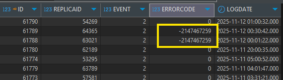
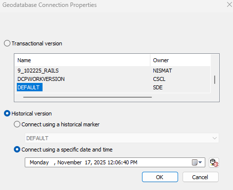
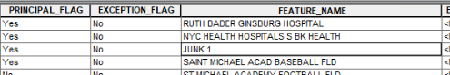
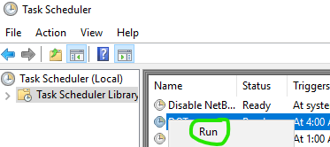

## Replica Hotline Runbook

This runbook is intended to help team members review and debug issues encountered in ESRI geodatabase replication. The scope is limited to the existing replica setup in the legacy CSCL environment.

#### 1. Acknowledge the issue reported by the replica user

#### 2. Review replica emails.  
    
* Reminder: failed replication scripts do not send notifications
* On what date did the success email last appear? The replications start before midnight and continue into the early hours of the next day.
* Which child replicas are impacted?

#### 3. Review database table logs

These tables are visible from SQL clients only. Users who are not familiar (or comfortable) with connecting as the geodatabase administrator and querying with SQL may want to skip this step.

* Parent geodatabase sde.gdb_replicalog
* Child geodatabase gdb_replicalog

The child geodatabase may be accessible only from the machine where the replica synchronization runs.



#### 4. Review the first replica script log. 

Connect to the machine where your colleagues have set up replica synchronization.  They have created one log in each REPLICATIONS/\<replicaname\> folder. It will have a descriptive name and end in .log.

Success vs failure:

```text
INFO: 2025-11-07 02:01:06,298 - Synchronizing spatial data changes.
INFO: 2025-11-07 02:39:28,964 - Spatial data synchronized successfully.
INFO: 2025-11-08 02:01:08,312 - Synchronizing spatial data changes.
ERROR: 2025-11-08 02:01:33,398 - ERROR 000582: Error occurred during execution. - Failed to execute (SynchronizeChanges).
INFO: 2025-11-08 02:01:33,398 - Spatial data synchronization failed.
```

#### 5. Review the detailed .dat replica log.  

This is the raw output from the ESRI synchronize changes tool and contains a few lines per dataset. You will find it in REPLICATIONS\replica_logs. Your colleagues have configured all replica synchronizations to write to a single log.

Here is a sample error message.

```text
<ReplicaMsg time='11/8/2025 12:01:09 AM' type='LOG_MESSAGE_TYPE_ERROR' code='90012' elapsed='0.455000 seconds' method='ReplicaDataSynchronizer::SyncRelatedDeletedObjects' objectClassName='xxxxxxx' replicaName='XXXX.XXXXX_XXX'>Error while deleting relationships records for RelationshipClass: xxxx.XXXXXX.SubwayStationsHaveFeatureNames.</ReplicaMsg>
```

If the source of the replica failure is bad data the steps above will guide you toward a specific set of edits on a specific date.  Bear in mind that the edit causing the problem may be a deletion.  In this case you will not see the bad data in the parent geodatabase.

#### 6. Review geodatabase archive (if appropriate) 

Use the archive functionality in ESRI desktop software to review edits made in the parent database. Right click on the xxx.sde connection file and select "Geodatabase Connection Properties." Then "Connect using a specific date and time."



Investigate datasets indicated in the logs before and after the failure date. A typical timeline is:

* Two days prior to failure: Bad data introduced in parent
* One day prior to failure: Bad data removed from parent
* Date of failure: "Error while deleting"

#### 7. Return your .sde connections to connect to DEFAULT (if appropriate) 

Do not forget. 

#### 8. Clean up bad data (if appropriate)

If you are confident that you have ID'd bad data then clean it up. Cleanup may need to be performed on the child by manually deleting the bad data.

Our most popular issue that wrecks replicas is when users add temporary "junk" records outside of the editing tools.



#### 9. Synchronize replicas (if appropriate)

Perform cleanup and replica synchronization re-runs one at a time. Start in a non-production environment if possible.

