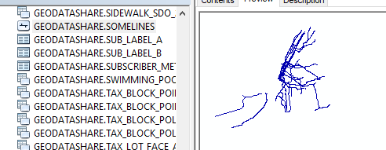
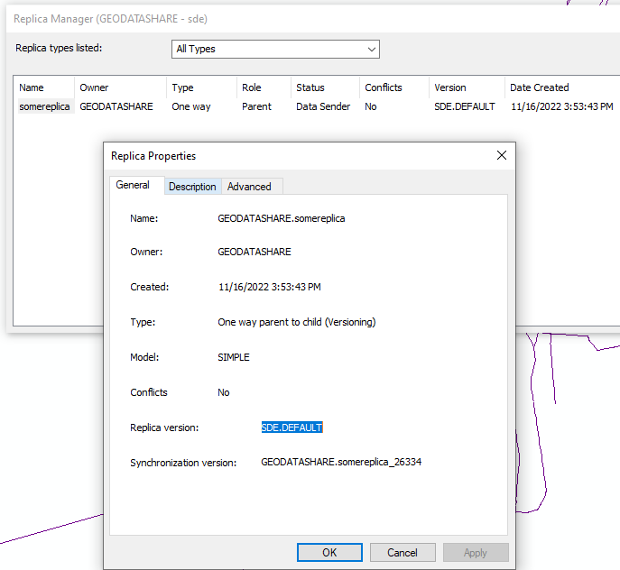
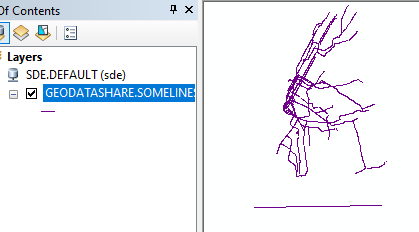
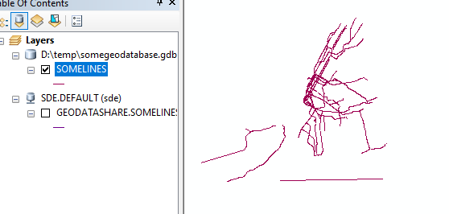
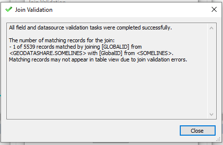

# Replica Setup For a Case With ESRI

This is a demonstration of the issue replicating from a parent Enterprise Geodatabase in Oracle to a child file geodatabase using:

* ArcGIS Desktop 10.7.1
    * ArcGIS Desktop 10.7.1 Support for Oracle 19c Patch
    * ArcGIS Desktop Background Geoprocessing 10.7.1 (64-bit)

## Create Replica  

1. Import somelines.shp into the parent enterprise geodatabase.  Verify that it does not have a column named globalid.
2. Add globalids in the parent enterprise geodatabase.
3. Register as versioned in the parent enterprise geodatabase

4. Use ArcCatalog to import this feature class from the parent to the child file geodatabase
6. Open ArcMap.  Add the feature class from the parent Enterprise Geodatabase to the map document.  
7. Add the "Distributed Geodatabase Toolbar" that we know and love
8. Choose create replica
9. Choose one-way parent to child
10. Register existing data only 
11. Choose the child file geodatabase as the "geodatabase to replicate to"
12. Check "Show Advanced Options"! We are advanced, we simply must see these options.
13. Choose Full Model. Do not check "use archiving to track changes."
14. Choose full extent
15. Uncheck replicate related data
16. Toggle the amazing "All Records for Tables" toggler so it reads "Schema Only For Tables" which now means the opposite. 
17. Next and do nothing

## Fake Edits to Test

1. Edit on the default version to simplify the flow
2. Start editing and delete all subways on Staten Island, they are not real subways. Save edits. 
3. Add a fish tube feature in the ocean. Save edits 
4. Stop editing

## Synchronize the changes

1. Select "Synchronize Changes" from the toolbar
2. Choose the parent geodatabase as geodatabase 1
3. Choose the replica and child file geodatabase as geodatabase 2
4. Direction is from 1 to 2
5. Conflicts in favor of gdb1
6. Conflicts defined by object

Only the fish tube gets added to the child replica.  Deletes are not deleted.

As a test, attempt to join parent to child on globalid using ArcMap. Only one record joins, new record that was synchronized. 

